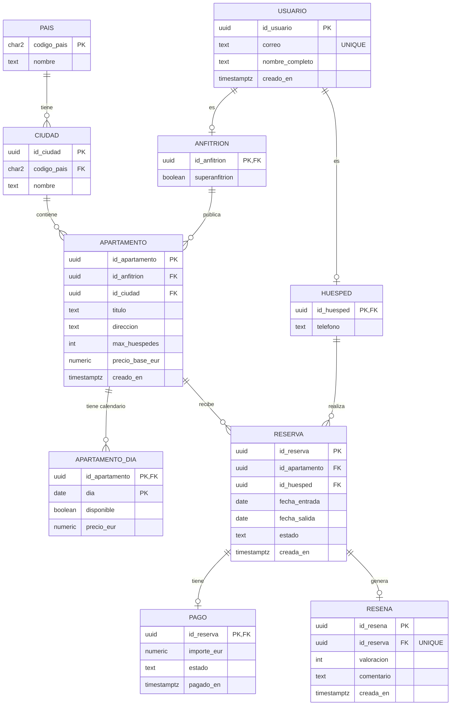
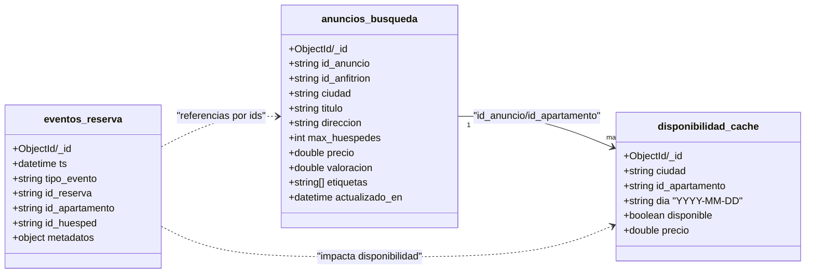

# Caso 1: Diseño y despliegue de una plataforma de reservas global

En esta demo vas a desplegar un sistema de reservas tipo **Airbnb** con dos bases de datos:

* **PostgreSQL (relacional)** para el núcleo transaccional y el modelo normalizado.
* **MongoDB (documental)** para lecturas rápidas con datos **desnormalizados** (búsqueda y disponibilidad).

La guía está escrita para que puedas **seguirla por tu cuenta** y obtener resultados visibles.

## 1) Estructura de directorios

```text
caso-1/
├─ docker-compose.yml
├─ mongo/
│  └─ init/
│     └─ init-mongo.sh
├─ postgres/
│  └─ initdb/
│     ├─ 01_esquema.sql
│     ├─ 02_indices.sql
│     └─ 03_datos_prueba.sql
└─ generator/
   ├─ Dockerfile
   ├─ requirements.txt
   └─ generate.py
```

**Resumen rápido:**

* `docker-compose.yml`: levanta Postgres + pgAdmin + Mongo + init + generador.
* `postgres/initdb/*.sql`: crea el esquema en español, índices y datos mínimos.
* `mongo/init/init-mongo.sh`: prepara índices en Mongo (en español).
* `generator/generate.py`: genera datos masivos (usuarios, apartamentos, reservas…) y los inserta en Postgres y Mongo.

## 2) Objetivos de aprendizaje

### Parte A — PostgreSQL (pgAdmin)

* Modelo relacional en **3FN** (tablas separadas, claves foráneas).
* Consultas típicas de negocio (búsqueda de apartamentos, disponibilidad, reservas).
* **Índices BTREE** (en temario: “B+”) y cómo comprobarlos con `EXPLAIN (ANALYZE)`.

#### Estructura de la base de datos relacional



### Parte B — MongoDB (Compass)

* Colecciones **desnormalizadas** para lectura rápida:

  * `anuncios_busqueda`: “listings” listos para buscar/ordenar.
  * `disponibilidad_cache`: disponibilidad por ciudad y día.
* Índices en colecciones para acelerar filtros y ordenaciones.
* Comparación conceptual: JOINs vs documentos listos para leer.

#### Estructura de la base de datos documental

Este diagrama refleja el enfoque “lecturas rápidas” con documentos desnormalizados:

* `anuncios_busqueda`: anuncios listos para filtrar/ordenar por ciudad, precio y valoración.
* `disponibilidad_cache`: disponibilidad diaria por ciudad y apartamento (ideal para búsquedas por fechas).
* `eventos_reserva`: eventos tipo time-series (opcional/extensible).



## 3) Arranque del laboratorio

### Paso 1 — Levanta el contenedor con la infraestructura

Desde la carpeta `caso-1/` utiliza la extensión _Container Tools_ e VSCode o ejecuta el siguiente comando desde la terminar:

```bash
docker compose up -d --build
```

### Paso 2 — Verifica contenedores

```bash
docker ps
```

Deberías ver (al menos):

* `rbnb_postgres`, `rbnb_pgadmin`
* `rbnb_mongo`
* `rbnb_mongo_init` (termina y se para)
* `rbnb_generator` (termina y se para)

> 📣 **Nota:** `mongo_init` y `generator` son “one-shot”: se ejecutan una sola vez y se detienen.

## 4) Conexión a PostgreSQL con pgAdmin

### Acceso

* Abre pgAdmin: [http://localhost:8080](http://localhost:8080)
* Usuario: `admin@example.com`
* Contraseña: `admin`

### Registrar el servidor (si no lo tienes)

En pgAdmin → **Register → Server**:

* **Name**: `RBnB`
* **Connection**

  * Host name/address: `postgres`
  * Port: `5432`
  * Maintenance database: `rbnb`
  * Username: `rbnb`
  * Password: `rbnb`

## 5) Conexión a MongoDB con MongoDB Compass

### URI de conexión

En Compass, crea una nueva conexión con:

```text
mongodb://localhost:27017
```

Una vez conectado:

* Abre la base de datos: `rbnb`
* Verás colecciones (por ejemplo):

  * `anuncios_busqueda`
  * `disponibilidad_cache`
  * `eventos_reserva` (puede estar vacía si no la estás poblando)

## 6) Demo en PostgreSQL (pgAdmin): consultas + EXPLAIN

En pgAdmin abre **Query Tool** sobre la base de datos `rbnb`.

### 6.1 Listar tablas (SQL)

```sql
SELECT tablename
FROM pg_catalog.pg_tables
WHERE schemaname = 'public'
ORDER BY tablename;
```

Tablas clave:

* `usuario`, `anfitrion`, `huesped`
* `pais`, `ciudad`
* `apartamento`, `apartamento_dia`
* `reserva`, `pago`, `resena`

### 6.2 Consulta 1 — “Apartamentos en una ciudad ordenados por precio”

```sql
EXPLAIN (ANALYZE, BUFFERS)
SELECT a.id_apartamento, a.titulo, a.precio_base_eur
FROM apartamento a
JOIN ciudad c ON c.id_ciudad = a.id_ciudad
WHERE c.nombre = 'Madrid'
ORDER BY a.precio_base_eur
LIMIT 20;
```

**Qué observar**

* ¿Aparece un `Index Scan` o `Bitmap Index Scan`?
* El índice que ayuda: `idx_apartamento_ciudad_precio`.

### 6.3 Consulta 2 — “Disponibilidad en los próximos 7 días”

```sql
EXPLAIN (ANALYZE, BUFFERS)
SELECT a.id_apartamento, a.titulo, d.dia, d.precio_eur
FROM apartamento a
JOIN ciudad c ON c.id_ciudad = a.id_ciudad
JOIN apartamento_dia d ON d.id_apartamento = a.id_apartamento
WHERE c.nombre = 'Madrid'
  AND d.dia BETWEEN CURRENT_DATE AND (CURRENT_DATE + INTERVAL '7 days')
  AND d.disponible = true
ORDER BY d.precio_eur
LIMIT 30;
```

**Qué estás aprendiendo**

* En relacional, disponibilidad “bien modelada” suele requerir JOIN.
* Índices como `idx_apartamento_dia_dia` ayudan cuando filtras por fecha.

### 6.4 Consulta 3 — “Histórico de reservas de un huésped”

```sql
EXPLAIN (ANALYZE)
SELECT r.id_reserva, r.fecha_entrada, r.fecha_salida, r.estado, a.titulo
FROM reserva r
JOIN apartamento a ON a.id_apartamento = r.id_apartamento
WHERE r.id_huesped = (SELECT id_huesped FROM huesped LIMIT 1)
ORDER BY r.creada_en DESC
LIMIT 20;
```

**Qué observar**

* Cómo un índice por `(id_huesped, creada_en DESC)` mejora el histórico.

## 7) Demo en MongoDB (Compass): filtros, ordenaciones e índices

En Compass:

1. Abre la colección **`anuncios_busqueda`**
2. Usa el panel **Filter / Sort / Project**

### 7.1 Búsqueda de anuncios por ciudad (filtro)

**Filter**

```json
{ "ciudad": "Madrid" }
```

**Project** (para ver solo lo importante)

```json
{ "titulo": 1, "precio": 1, "valoracion": 1, "max_huespedes": 1, "_id": 0 }
```

**Sort**

```json
{ "precio": 1 }
```

**Qué estás aprendiendo**

* Aquí no hay JOIN: el documento ya trae ciudad, precio, valoración, etc.
* Mongo está optimizado para “leer rápido lo que ya está preparado”.

### 7.2 Disponibilidad por ciudad y día (cache)

Abre **`disponibilidad_cache`**:

**Filter**

```json
{ "ciudad": "Madrid", "dia": "2026-02-10", "disponible": true }
```

**Project**

```json
{ "id_apartamento": 1, "precio": 1, "_id": 0 }
```

**Limit**

* 20

**Qué estás aprendiendo**

* La disponibilidad está “precomputada” para responder muy rápido.
* Esto es típico de sistemas globales: cache/denormalización para lecturas.

### 7.3 Ver índices en Compass

En cada colección, entra en la pestaña **Indexes**:

* `anuncios_busqueda`: índice por `{ ciudad, precio, valoracion }`
* `disponibilidad_cache`: índices por `{ ciudad, dia, disponible }` y `{ id_apartamento, dia }`

## 8) Comparación final

**PostgreSQL**

* Ventaja: integridad, 3FN, transacciones, consistencia.
* Coste: JOINs y planificación de índices para que sea rápido.

**MongoDB**

* Ventaja: lecturas rápidas con documentos listos (búsqueda/disponibilidad).
* Coste: duplicación de datos y necesidad de mantener el “cache” coherente.

## 9) Ejercicios extra

De manera opcional, te animo a realizar estos ejercicios para reforzar lo aprendido.

1. **PostgreSQL**: cambia ciudad (`Madrid` → `Barcelona`) y compara el tiempo en `EXPLAIN (ANALYZE)`.
2. **PostgreSQL**: quita `ORDER BY` y observa si cambia el plan.
3. **Mongo**: en `anuncios_busqueda`, ordena por `valoracion` descendente y luego por `precio` ascendente.
4. **Mongo**: en `disponibilidad_cache`, prueba otro día y compara la cantidad de resultados.
